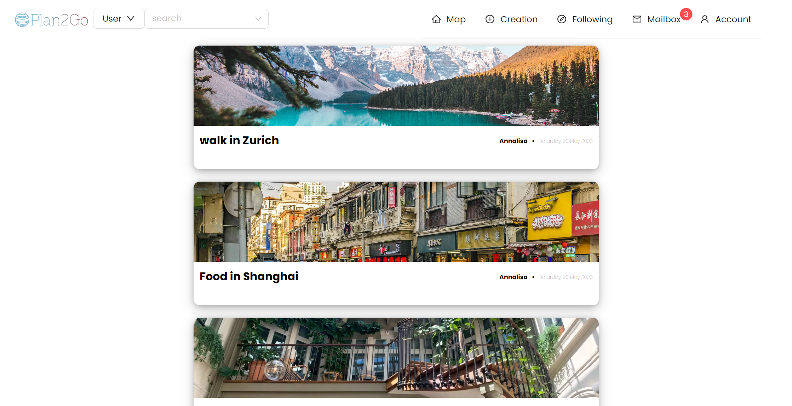

# Plan2Go - Client
Plan2Go is a social media platform designed exclusively for travel. It can be a tour guide, a resaturant reference and a place you can tell your own stories and share all your experience during adventures.
Explore your next trip with Plan2Go!
## Launch & Deployment

In the project directory, you can run:
### `npm install all`
Install all the necessary dependencies.

### `npm start`

Runs the app in the development mode.\
Open [http://localhost:3000](http://localhost:3000) to view it in your browser.

The page will reload when you make changes.\
You may also see any lint errors in the console.

### `npm test`

Launches the test runner in the interactive watch mode.\
See the section about [running tests](https://facebook.github.io/create-react-app/docs/running-tests) for more information.

### `npm run build`

Builds the app for production to the `build` folder.\
It correctly bundles React in production mode and optimizes the build for the best performance.

The build is minified and the filenames include the hashes.\
Your app is ready to be deployed.

See the section about [deployment](https://facebook.github.io/create-react-app/docs/deployment) for more information.
## Technology
React\
Java Spring Boot\
REST\
MUI\
Ant Design\
Editor.js\
Leaflet\
Cloudinary\
WebSocket

## Demo
The Home page of website is a world map which display all the Travel notes with location created by users.

User can manage their profile and content created from profile page.

User can create two types of content: Post and Travel note, and share the Travel notes by Post

As a social media platform, the website enables users to follow other users and browser updates from the users they are following.

The user will receive message when other users interact with their post and travel note.

